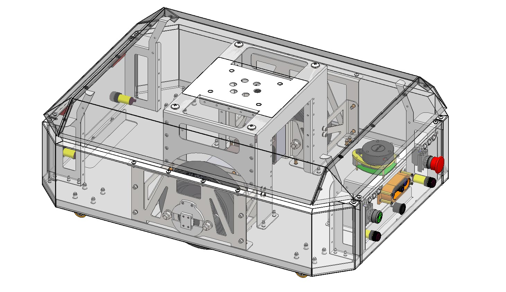
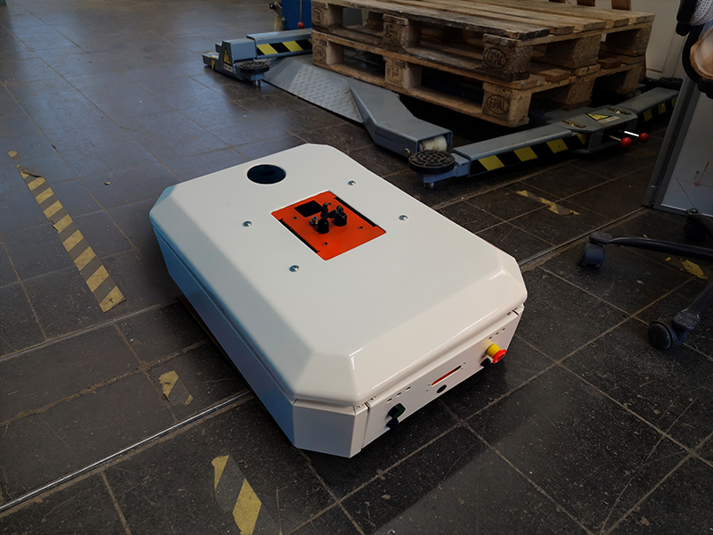
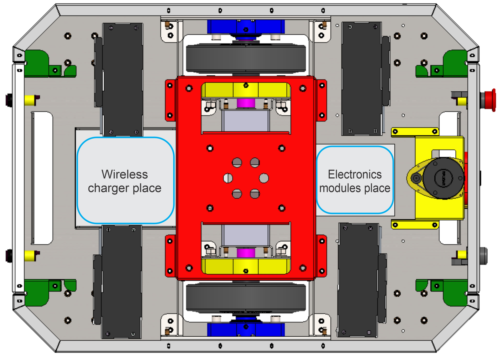
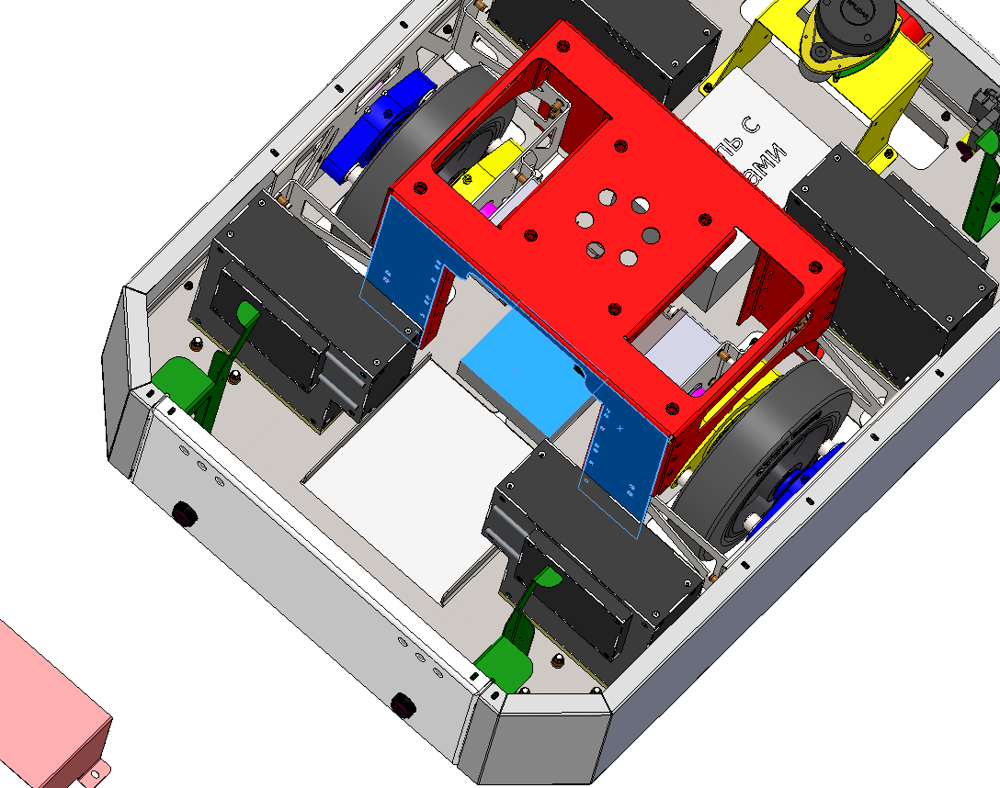
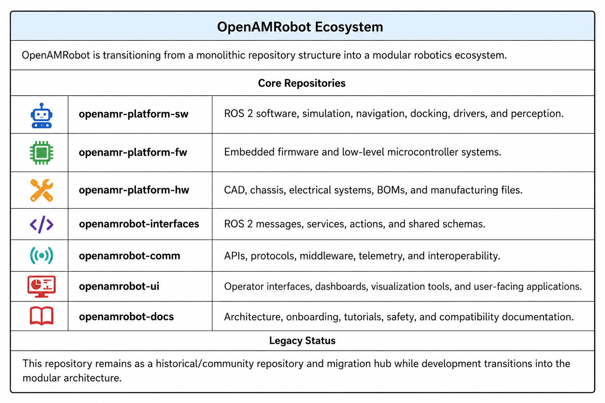

# OpenAMR Platform Hardware

Hardware documentation for the **OpenAMRobot** differential-drive mobile base: electrical
wiring and pinouts, power distribution, computing, sensors, motor control, the bill of
materials, and safety notes.

**The physical robot** — the base shown above, built and running (here in an SME / logistics setting):

**Status: experimental / documentation-first.** The electrical, BOM, safety, and now the
**mechanical CAD** (chassis, production files, renders) and **datasheets** are real and maintained.
The PCB directory is still an **empty placeholder** (see [Release scope](#release-scope)).

> ## ⚠️ Read this before wiring anything (can physically damage hardware)
> - **Teensy 4.0 GPIO is 3.3 V and NOT 5 V tolerant** (abs. max ~3.6 V). Feeding a 5 V signal
>   into a Teensy input can **destroy the pin / the board**.
> - **The AS5040 encoders must be powered from the 3.3 V rail**, not 5 V. At 5 V their A/B
>   outputs swing to ~4 V and over-drive the Teensy inputs. This was found and fixed on
>   2026-06-19 — see [encoders.md](electrical/sensors/encoders.md). Do not revert it.
> - **No fuse and no battery-side disconnect are fitted yet** — see
>   [Known hardware limitations](#known-hardware-limitations).

---

The overall system is shown in the block diagram above.

## Current validated hardware configuration

The configuration the docs describe and that has run the real robot:

| Subsystem | Part | Notes |
|---|---|---|
| Compute | **Raspberry Pi 5, 8 GB** | Ubuntu Server 24.04 + ROS 2 Jazzy. **No active cooler fitted** → thermal throttling under the stack. [raspberry-pi.md](electrical/computing/raspberry-pi.md) |
| Microcontroller | **Teensy 4.0** | micro-ROS motor control. 3.3 V I/O, **not 5 V tolerant**. [teensy.md](electrical/computing/teensy.md) |
| Motors | **ZD Z4BLD60-24GN-30S ×2** | 3-phase BLDC, 24 V, 60 W, 5 pole pairs, 3000 rpm + **1:25** gearbox (4GN 25K) → **120 rpm** wheel. [motors-drivers.md](electrical/motor_control/motors-drivers.md) |
| Motor drivers | **ZBLD.C20-120L2R ×2** | 24 V, 7.5 A, 120 W. Set **DIP SW4/SW5 = 5 pole pairs**. LED [fault codes](electrical/motor_control/motor-driver-fault-codes.md) |
| Wheel encoders | **AS5040 ×2** | magnetic quadrature, 1024 cnt/rev at wheel scale. **3.3 V supply.** [encoders.md](electrical/sensors/encoders.md) |
| IMU | **MPU6500** *(board silkscreen says MPU-6050; actual silicon is a 6500 — `WHO_AM_I` 0x70)* | 3-axis accel + gyro. **No magnetometer** (`/imu/mag` carries no real field). 3.3 V. [imu.md](electrical/sensors/imu.md) |
| LiDAR | **RPLIDAR A1** | 2D scan, USB (CP2102). [lidar.md](electrical/sensors/lidar.md) |
| Camera | **Raspberry Pi Camera Module 3 NoIR (IMX708)** | CSI ribbon, not USB. [camera.md](electrical/sensors/camera.md) |
| Power | **24 V battery** (any chemistry; reference build = 2× 12 V in series) | ≥25 V at rest before tests (reference lead-acid threshold). [power.md](electrical/power_distribution/power.md) |

**Drivetrain (odometry):** wheel **⌀ 0.2 m** (radius 0.10 m), track **0.46 m** — firmware values,
physically measured. See the [BOM drivetrain section](manufacturing/bom/components-bom.md) (and the
note there about a stale 0.046533 m value that was a CAD artifact).

**Internal layout (cover removed):**

More views, renders and the full CAD are in [`mechanical/`](mechanical/).

---

## Documentation index

**Wiring & pinout (start here for a build):** **[wiring-pinout.md](electrical/wiring/wiring-pinout.md)**
— full Teensy pinout, driver wiring, DIP switches, motor wiring, grounding, ASCII map.

**Bill of materials:** **[components-bom.md](manufacturing/bom/components-bom.md)** (electrical) +
**[mechanical-bom.md](manufacturing/bom/mechanical-bom.md)** (sheet metal, fasteners, wheels).

**Mechanical CAD:** **[mechanical/](mechanical/)** — full STEP assembly, per-part production files
(PDF/DXF/SLDPRT/STEP), the SolidWorks project, and renders.

**Product architecture:** **[product-architecture.md](product-architecture.md)** — the base build
vs. the optional/roadmap parts.

### Electrical
- Computing — [Raspberry Pi 5](electrical/computing/raspberry-pi.md) · [Teensy 4.0](electrical/computing/teensy.md)
- Motor control — [motors & drivers](electrical/motor_control/motors-drivers.md) · [driver LED fault codes](electrical/motor_control/motor-driver-fault-codes.md)
- Power — [power distribution & battery](electrical/power_distribution/power.md)
- Sensors — [encoders (AS5040)](electrical/sensors/encoders.md) · [IMU (MPU6500)](electrical/sensors/imu.md) · [LiDAR (RPLIDAR A1)](electrical/sensors/lidar.md) · [camera (IMX708)](electrical/sensors/camera.md)
- Wiring — [wiring & pinout](electrical/wiring/wiring-pinout.md)

### Manufacturing & safety
- [Bill of materials](manufacturing/bom/components-bom.md)
- [Hardware safety notes](safety/safety.md)

---

## Release scope

What is **included and maintained**:
- `electrical/` — computing, motor control, power, sensors, wiring (all populated).
- `mechanical/` — **CAD** (full STEP assembly, per-part production files, SolidWorks project) + renders.
- `manufacturing/bom/` — electrical **and** mechanical bills of materials.
- `manufacturing/assembly/` — wheel-assembly guide.
- `datasheets/` — component datasheets (re-hosted, manufacturer copyright) + motor sizing calculations.
- `safety/` — hardware safety documentation.
- `diagrams/` — repository-level diagrams (per-subsystem diagrams live in each subsystem's `diagrams/`).

What is **placeholder / not yet populated** (empty directories, planned):
- `electrical/pcb/`
- `manufacturing/vendors/`
- `interfaces/`

---

## Known hardware limitations

Honest disclosure — these are **not yet fixed** and are safety-relevant:

1. **No fuse on the 24 V battery.** A 24 V battery can deliver hundreds of amps into a short.
   Add a **15–20 A fuse/breaker** on the battery `+`. See [power.md](electrical/power_distribution/power.md).
2. **No battery-side disconnect / hardware E-stop.** Only the mains has a switch; there is no fast
   cut-off for the 24 V battery. Add a switch/disconnect — ideally an **E-stop mushroom** — on `+`.
3. **No active cooler on the Pi 5** → thermal throttling under the full stack (measured ~83 °C).
   Fit the official Active Cooler. See [raspberry-pi.md](electrical/computing/raspberry-pi.md).
4. **Pi 5 bring-up brown-out risk**: the 5 V/5 A supply can sag on the current spike at launch,
   freezing the Pi. See [power.md](electrical/power_distribution/power.md).
5. The firmware's 200 ms command watchdog is **not** a substitute for a physical E-stop.

---

## Repository boundaries

Hardware and mechatronics documentation belongs here — **`openamr-platform-hw` is the CAD, chassis,
electrical, BOM and manufacturing repo** of the OpenAMRobot ecosystem:

Related repositories:

- **`openamr-platform-fw`** — Teensy motor-control firmware.
- **`openamr-platform-sw`** — ROS 2 software (description, Gazebo, Nav2, docking).

## Safety notice

Hardware work involves mechanical, electrical, battery, and motor hazards. Users are responsible
for validating mechanical, electrical, battery, and wiring safety, manufacturing quality, and
regulatory compliance before building or operating hardware based on this documentation.

## License

**MIT** (Copyright (c) 2026 OpenAMRobot) for the documentation and BOM currently in this repo —
see [`LICENSE`](LICENSE). Hardware design files (CAD/schematics/PCB), when added, are planned under
**CERN-OHL-S-2.0**. See [`NOTICE.md`](NOTICE.md).
