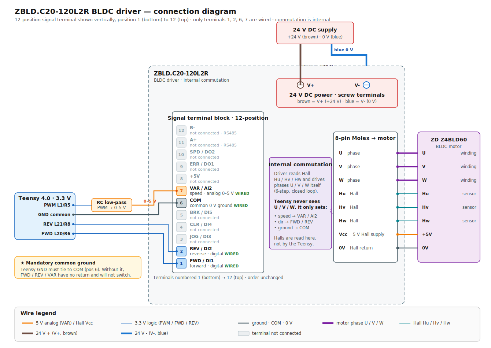

# Motors & drivers (BLDC + ZBLD)

*Last updated: 2026-06-17.*

## Overview
Two **BLDC** (brushless) motors, one per wheel, each driven by its own **ZBLD** driver. The Teensy
sends low-current logic signals to the drivers; the drivers deliver the 24 V power to the motor phases.

- **Motors**: **ZD Z4BLD60-24GN-30S** ×2 — 3-phase BLDC, 24 V, **60 W**, **P=5 (5 pole pairs, on the
  nameplate)**, **3000 rpm** motor + **1:25 spur gearbox** (4GN 25K) → **120 rpm** wheel, rated **3.8 A**.
  U/V/W + Hall. (LEFT=M1, RIGHT=M2) See the [sizing calculations](../../datasheets/motor-sizing-calculations.md).
- **Drivers**: **ZBLD.C20-120L2R** ×2 (24 V, 7.5 A, 120 W). Full specs + datasheets:
  [components-bom.md](../../manufacturing/bom/components-bom.md). **Red LED / fault blink codes:**
  [motor-driver-fault-codes.md](motor-driver-fault-codes.md).
- ⚠️ **Pole pairs = 5** → verify the driver **DIP SW4/SW5** are set to 5 pole pairs (read the silkscreen
  table on the driver). A wrong pole-pair setting throws off the driver's closed-loop speed scaling.

## Manufacturer reference diagram

The driver's full terminal layout, DIP-switch table, and LED status codes, from the manufacturer:

*Source: ZD **ZBLD.C20-120L2R** product manual (manufacturer reference figure). This robot wires only a
subset of these terminals and uses a specific DIP configuration — both are detailed below.*

## Communication (Teensy → driver)

The motor-control signal chain is shown below.

Per motor, 3 logic lines from the Teensy:

| Teensy signal | Driver input | Meaning | Left pin | Right pin |
|---|---|---|---|---|
| PWM | `VAR / AI2` | speed setpoint — Teensy PWM @ **3 kHz** on this robot (driver capability: PWM 0–20 kHz, or analog 0–5 V) | **1** | **5** |
| IN_A | `FWD / DI1` | forward direction | **20** | **6** |
| IN_B | `REV / DI2` | reverse direction | **21** | **8** |
| GND | `COM` | **common ground (mandatory)** | GND | GND |

- Power side: `DC+ / DC− = 24 V` (with a fuse). Motor side: phases U/V/W + Hall.
- ⚠️ The driver `COM` **must** be tied to the Teensy GND, otherwise signals/encoders are noisy.

Of the driver's twelve control terminals, this robot wires only **four** — the connections are shown below:

## Driver configuration — DIP switches (SW1–SW6)
Both drivers must be set **identically**. Functions read from the driver silkscreen (2026-06-19):

| Switch | Function | What it does | Was (pre 06-19) | **Now (applied 06-19)** |
|---|---|---|---|---|
| **SW1** | open / closed loop (`开环/闭环`) | ON = driver regulates speed itself from the Halls; OFF = driver is just a power stage (Teensy regulates) | ON | **OFF** |
| **SW2** | speed source (`AI1/AI2`) | OFF = internal VAR knob; ON = external 0–5 V on `VAR/AI2` (our Teensy PWM) | ON | ON |
| **SW3** | secondary (direction/internal) | no effect here (direction is driven by FWD/REV pins) | OFF | OFF |
| **SW4 / SW5** | **motor pole pairs** (`极对数`) | tells the driver the pole-pair count (2/3/4/5) to convert Hall freq → RPM. **Only used in closed loop** | OFF/OFF (= 2 pp ⚠️) | **ON/ON (= 5 pp)** |
| **SW6** | RS485 termination (`485 终端电阻`) | bus end resistor; not used (no RS485) | OFF | OFF |

> 🔶 **Pole-pair mismatch found & corrected (2026-06-19):** the motor is **P=5** (5 pole pairs, on the
> nameplate) but SW4/SW5 were OFF/OFF (= 2 pole pairs). Now set to **ON/ON (= 5 pp)**. (Only matters in
> closed loop; harmless but correct in the current open-loop config.)

### Which controller is best — driver vs Teensy PID?
The **Teensy PID is the better controller for this robot** and should be the authoritative one:
- it reads the **AS5040 encoder (1024 cnt/rev)** → fine resolution, and measures the **wheel** speed
  (post-gearbox) — the variable we actually care about (motion + odometry);
- it is **fully tunable** (K_P/K_I/K_D, already tuned to ±2 %), and feeds ROS `/odom`.
- the driver's loop measures the **motor shaft** (pre-gearbox) with **coarse Hall** sensors, is **opaque**
  (only VAR/ACC pots), and needs correct pole pairs.

→ **Run the driver open-loop (SW1=OFF)** so the Teensy is the sole regulator (removes the double-loop that
worsens snaking; makes pole pairs irrelevant). **Plan B** if low-speed cogging appears: go back to closed
loop (SW1=ON) **with SW4/SW5=ON/ON (5 pp)** for a proper cascade (fast driver inner loop + Teensy outer).
The only edge the driver loop has: at low *wheel* speed the motor shaft still spins ~30× faster → richer
Hall signal → potentially smoother very-low-speed than the 50 Hz Teensy loop.

**Config applied 2026-06-19 (both drivers):** `SW1 OFF · SW2 ON · SW3 OFF · SW4 ON · SW5 ON · SW6 OFF`.
(Was SW1 ON, SW2 ON, rest OFF.) **Validated** over 3 motor runs — see
the `openamr-platform-sw` troubleshooting doc (`docs/troubleshooting/diagnostics.md` in that repo).

> ⚠️ **VAR pot is inert in this config**: with SW2=ON the speed comes from AI2 (the PWM), not the VAR/AI1
> pot, so turning VAR does **not** balance the wheels (confirmed: no change across runs). The residual
> ~9 % open-loop L/R asymmetry (right faster) is corrected by the **Teensy PID** (→ ~0.2 % in closed loop).

## Driver configuration — TWO trim pots (CRITICAL)
Each driver has **two** potentiometers. **They must match between LEFT and RIGHT** (calibrate the right
to the left, the known-good reference).

> ⚠️ **Read this alongside the config state.** The VAR **gain** effect below (and the "runaway" root cause)
> applies when **VAR is in the speed path** — i.e. the *original* config (VAR/AI1 selected, or an AI2 gain
> that scales the PWM). In the **current config (SW1=OFF open loop, SW2=ON → AI2)** the **speed comes from
> the PWM on AI2, so the VAR pot is inert for balancing** (see the note above) — the values below are the
> setting to leave it at, not a live balancing knob. ACC/DEC still ramps in either config.

| Pot | Location | Function | Correct setting | Symptom if wrong (when VAR is in the speed path) |
|---|---|---|---|---|
| **VAR** | top | speed / gain (PWM → speed) | ~3.5/10, **same** both sides | too high → wheel runs ~8× too fast → **runaway** |
| **ACC/DEC** | near the DIP switches | acceleration/deceleration ramp | **4/10**, same both sides | =0 → no smoothing → **jerks/oscillation** in closed loop |

See the full story in the `openamr-platform-sw` troubleshooting doc (`docs/troubleshooting/diagnostics.md` in that repo).

## Low-speed behaviour — measured velocity floors (2026-07-02)
Closed-loop sweep **on the ground / under load** (`/cmd_vel` with the PID + dither, as in docking),
real velocity read on `/odom/unfiltered`:

| Axis | Stall | Judder | **Reliable floor** | Clean |
|---|---|---|---|---|
| **Linear** | ≤ 0.02 m/s | 0.03 (min 0, std 0.018) | **0.04 m/s** (min 0.020) | **0.05 m/s** (std 0.004); 0.06–0.10 perfect |
| **Angular** | ≤ 0.08 rad/s | 0.10–0.12 (min 0, high std) | **0.15 rad/s** (min 0.093) | 0.20–0.30 perfect |

> ✅ **The motor is WELL-SIZED (over-sized on torque).** Above the floors the real/commanded ratio is
> **~1.0** → no torque shortfall. The floors are **stick-slip (static friction) + coarse Hall commutation
> at low RPM** (an *operating-point* limit, not a sizing one). Reference: the Z4BLD60-24GN-30S + **1:25**
> gearbox gives a mechanical no-load max of ~**1.26 m/s** (software-capped to ~0.71 m/s) and ~**3.48 N·m/wheel**
> (specs in [components-bom.md](../../manufacturing/bom/components-bom.md), derivation in the
> [sizing calculations](../../datasheets/motor-sizing-calculations.md)).

**Consequence:** keep commanded velocities **above the floors**. Docking applies this (drive taper floored
at 0.05 m/s, scan rotation 0.17 rad/s, a `min_turn_omega` of 0.15 rad/s with a small deadband so
sub-floor yaw corrections are snapped up or zeroed rather than stalling). Judder on each start-from-standstill
is the static-friction breakaway; a taper (or the driver ACC/DEC ramp) mitigates it.

## Good to know / gotchas
- The original fault ("right wheel runs away, robot doesn't go straight") was **100 % driver tuning**, in
  the **original config where VAR was in the speed path**: the right VAR pot was at max (10) and its
  ACC/DEC pot at 0. After matching both pots to the left, the right wheel tracked correctly. *(Separately,
  during open-loop balancing on 2026-06-19, raising the right VAR made the right wheel speed up to match a
  faster left — same knob, opposite direction, because it was a different starting point.)*
- ⚠️ In the **current config (SW2=ON, AI2 source)** VAR no longer balances the wheels — the residual L/R
  asymmetry is handled entirely by the **Teensy PID** (the right channel needs slightly more PWM for the
  same speed; the PID compensates → ~0.2 % in closed loop). Do not chase balance with the VAR pot here.
- Test the motors safely with the **open-loop mode** (`/debug/openloop`) which bypasses the PID — useful
  to compare the two channels at identical PWM. See the `openamr-platform-fw` debug-telemetry doc (`docs/architecture/debug-telemetry.md`).
- **Always**: wheels off the ground, 24 V on, a hand on the 24 V cut-off for the first tests.
