# Power & electrical safety

*Last updated: 2026-06-20.*

## 🔋 Battery state of charge — THRESHOLDS (24 V lead-acid) — READ BEFORE ANY NAV TEST
24 V system = 2× 12 V lead-acid in series. **At-rest** voltage (no load):

| At-rest voltage | State | For navigation |
|---|---|---|
| **~25.5–26 V** | full charge | ✅ OK to test |
| **~24.5 V** | ~70 % | ✅ acceptable |
| **~24 V** | ~50 % | ⚠️ marginal |
| **≤ 23.5 V** | discharged (~30 %) | ❌ **DO NOT test nav** |

⚠️ This is the **at-rest** voltage: **under load (motors) it drops further** (often −1 to −2 V at peaks,
since the pack sags). Below ~22 V under load → drivers undervoltage (ZBLD **fault code 10**, see
[motor-driver-fault-codes.md](../motor_control/motor-driver-fault-codes.md)) → **weak torque + left wheel
(loose contact) drops out → the robot does not follow the plan → it hits obstacles that nav was actually
avoiding.** **RULE: aim for ≥ 25 V at rest before any navigation/avoidance test.** Otherwise we debug Nav2
for nothing (already happened: the real problem was the 24 V, not nav).

**Reading 2026-06-20 (end of session)**: battery at **23.4 V at rest → too low**. Every avoidance test
from this session is inconclusive until the battery is recharged (~25.5 V). To be resumed after charging.

The power distribution is shown in the diagram below.



## Power architecture — VERIFIED 2026-06-19
```
Battery 24V ──┐
              ├──(parallel)──► V+ / V−  of BOTH drivers   (brown = V+, blue = V−)
Mains 24V  ───┘
              └──(parallel)──► DC-DC 24V→5V ──► Raspberry Pi ──USB──► Teensy ──► IMU + encoders (3.3V)
```
| Element | Supply |
|---|---|
| Motors / drivers | **24 V DC** on `V+ / V−` of each driver. Wire colors: **brown = V+, blue = V−** (confirmed) |
| 24 V source | **battery pack** (lead-acid) **or** an **AC/DC converter** (230 V mains) — wired **in parallel** to the same 24 V bus |
| Raspberry Pi | **DC-DC 24 V→5 V** buck from the 24 V bus |
| Teensy | powered over **USB** from the Pi (5 V) |
| **IMU + encoders** | **3.3 V from the Teensy** (3.3 V rail). The encoders were originally on the 5 V (VUSB) pin → ~4 V on the Teensy inputs → moved to 3.3 V on 2026-06-19; see ⚠️ encoder overvoltage in [encoders.md](../sensors/encoders.md). The IMU has always been on 3.3 V. |
| LiDAR | powered over its USB (CP2102 adapter) from the Pi |

## 🔴 Safety gaps found (2026-06-19) — to fix
1. **No fuse on the battery.** A lead-acid pack can deliver **hundreds of amps** into a short → fire /
   burns / melted wires if a 24 V conductor touches ground. **Add a fuse (or breaker) on the battery `+`**,
   as close to the terminal as possible. Sizing: 2 motors × **3.8 A** nominal ≈ 7.6 A + the DC-DC → a
   **~15–20 A** fuse (above nominal, below the wire/battery limit). ⚠️ This is above *nominal*, not the
   *stall* current — a jammed motor draws well above 3.8 A, so a fast-blow at 15–20 A may nuisance-trip or a
   short one may not clear a stall instantly; confirm the motor stall current before finalising.
2. **No battery-side disconnect** (only the mains has a switch). No fast hardware cut-off for the 24 V
   battery. **Add a switch/disconnect — ideally an E-stop mushroom** — on the battery `+`.
3. **Battery AND mains in parallel** on the same bus: if both are ever connected **at once**, the stiffer
   source back-feeds the other (risk to the AC/DC, or uncontrolled battery charge). **Only one source at a
   time** — a source selector switch would make this safe.

## Battery pack
- **4 × 12 V lead-acid** batteries (the big black ones).
- Wired **2 in series → 24 V** (one "pair"). With 2 pairs you can make **24 V** (pairs in parallel, more
  capacity) **or 48 V** (pairs in series) — this matches the OpenAMR platform's "24/48 V" spec.
- **In practice we usually run a single pair = 24 V.**
- ⚠️ Lead-acid basics: respect polarity, don't short the terminals (very high current), charge with a
  suitable lead-acid charger, and don't fully deep-discharge them (shortens life).

The Teensy sends only **low-current logic signals** to the drivers; the **24 V power** goes through the
drivers to the motor phases. Logic ground (Teensy GND) and driver `COM` must be **common**.

## ⚠️ Electrical safety — 230 V AC (read this)
The 24 V side is low-risk, but the **AC/DC converter is fed by 230 V AC, which is potentially lethal.**

- Touching exposed 230 V can cause cardiac fibrillation, "can't-let-go" muscle tetany, burns. ~30 mA
  through the body is already dangerous.
- If the converter's mains terminals are exposed/unprotected, **treat it as dangerous** and let nobody
  touch it while powered.

**Minimum protections (in priority order):**
1. **30 mA RCD / residual-current device** upstream — the single most important life-saver (cuts power in
   milliseconds on a ground/body leak).
2. **Enclose all 230 V wiring** in a closed box — no bare mains conductor reachable by a finger.
3. **Earth** the converter's metal chassis (protective conductor).
4. **Fuse / breaker** on the mains input (short-circuit / overload).
5. **Strain relief** on the mains cable; prefer an IEC inlet over flying leads.
6. **Golden rule**: cut/unplug the mains **before** touching anything on the power side. Never work live.

## Battery vs mains — measured 2026-06-18 (battery sags under load)
Same motor step (0.25 m/s ≈ 24 rpm), comparing the PWM the PID needs to reach that speed:

| Supply | PWM needed for ~23 rpm |
|---|---|
| AC/DC mains (24 V stiff) | ~180–220 |
| Battery pack | **~290–349** (~60 % more) |

The battery read **24.4 V at rest** but needs **~60 % more PWM** under load → it **sags under load**
(weak/discharged pack or high internal/contact resistance). Not blocking now (PID compensates, PWM ≈ 34 %
of the 1023 max), but at higher speeds it will **plateau**, and a sagging 24 V rail is what made the
**left wheel drop out** when its cable also had a loose contact (see the `openamr-platform-sw` troubleshooting doc (`docs/troubleshooting/diagnostics.md` in that repo)).

**Practical rule:** keep the pack **charged**; if motors feel weak / one wheel drops, **check battery
voltage under load** (multimeter on the terminals while commanding) and the 24 V connectors before
suspecting the firmware/PID. Bench-test on mains for repeatable results.

## ⚠️ Pi 5 brown-out at bring-up — the 5 V rail must hold ≥ 5 A (2026-06-25)
The Raspberry Pi 5 needs **5 V / 5 A**. At bring-up, motors + LiDAR + camera start **at the same time** →
a **current spike on the 5 V rail** → if the DC-DC (or a sagging 24 V pack) can't hold it, the rail
collapses and the **Pi freezes (Ctrl-C dead) then loses the network** (no ping). At boot the Pi warns:
*"This power supply is not capable of supplying 5A; power to peripherals will be restricted."*

- **Symptoms** (a whole session, 2026-06-25): frozen terminal during a launch, SSH drops, `No route to
  host`, LiDAR stops, involuntary reboots. **Before blaming the software, check the Pi is still alive
  (`ping`).** This is a *power* failure, **not** the thermal throttling (that one keeps the Pi online — see
  [raspberry-pi.md "Thermal"](../computing/raspberry-pi.md)).
- **Cause = insufficient 5 V supply** (worse when the 24 V pack is low → the buck can't source the peak).
  No ROS/software setting fixes it.
- **Fixes:** battery **≥ 25 V** (thresholds above); a **5 V buck rated ≥ 5 A peak** with a short/thick
  cable; or the official 5 V/5 A supply for bench tests. **Confirmation test:** launch the bring-up
  **without the camera** (lighter load) — if it holds, it's the supply (the camera adds the fatal peak).
- Same root cause hits the **motor drivers**: a 24 V bus too low trips **fault code 10 (busbar
  under-voltage)** on both ZBLD drivers at once — see
  [motor-driver-fault-codes.md](../motor_control/motor-driver-fault-codes.md). Low battery is the common
  thread (Pi brown-out + drivers code 10 + soft torque).

## Stopping the robot quickly (test safety)
- Software: stop publishing `/cmd_vel` → firmware zeroes motors after 200 ms (watchdog). `Ctrl-C` on the
  publisher works too.
- Hardware backstop: keep a hand on the **24 V cut-off** during powered tests. Wheels off the ground.

## TODO / to document
- Charger model, AC/DC converter model, and whether a physical **E-stop** exists (a ROS-independent
  emergency stop is recommended). *(Battery capacity is known: DM12-7S = 12 V 7 Ah, a pair in series =
  24 V 7 Ah — see [components-bom.md](../../manufacturing/bom/components-bom.md). Fuse: ~15–20 A, see the
  safety gaps above.)*
- A **battery voltage monitor** would be useful (lead-acid sags under load; low voltage → erratic motors).
