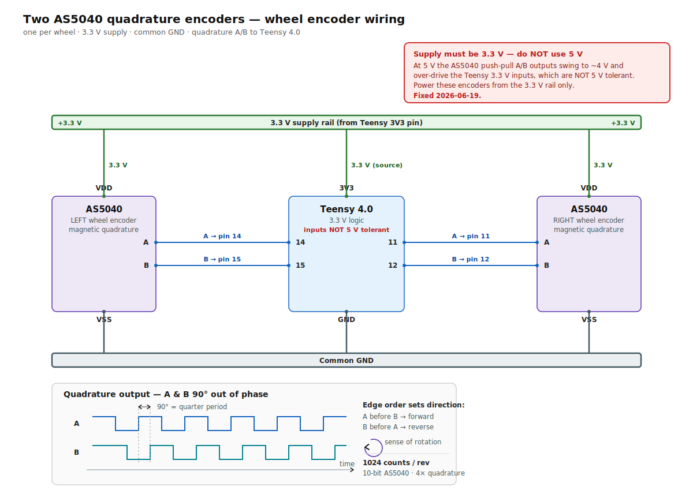

# Encoders (AS5040)

*Last updated: 2026-06-17.*

## Overview
Magnetic incremental encoders, one per wheel, that let the Teensy measure each wheel's rotation
(for speed feedback in the PID and for odometry).

| | |
|---|---|
| Type | AS5040 magnetic, quadrature A/B |
| Resolution | **1024 counts/rev** (`COUNTS_PER_REV` in firmware) |
| **Supply voltage** | **3.3 V** (from the Teensy 3.3 V rail; was 5 V until the 2026-06-19 fix) ⚠️ see hazard below |

> ✅ **RESOLVED 2026-06-19 — encoders moved to 3.3 V supply.** *History:* the encoders were powered at
> **5 V**, and the AS5040 A/B outputs (output level = supply) read **~4 V** at the Teensy pins. The Teensy
> 4.0 inputs (14/15/11/12) are **3.3 V, NOT 5 V tolerant** (abs. max ~3.6 V); the ~4 V meant the Teensy's
> clamp diode was conducting (out of spec, ages the pin).
> **Fix applied:** the AS5040 is rated 3.3–5 V (internal regulator), so its **supply was moved from the
> Teensy 5 V (VUSB) pin to the 3.3 V rail**. Verified: supply = 3.3 V, A/B lines now top out at **~3.3 V**
> (no more 4 V), and the encoders **count cleanly** (validated over 3 sustained motor runs — see
> the `openamr-platform-sw` troubleshooting doc (`docs/troubleshooting/diagnostics.md` in that repo)). The 5 V (VUSB) pin now feeds nothing (normal).
> *Alternative fixes if 3.3 V had browned out:* series R ~1–2.2 kΩ or a divider per A/B line, or a
> level-shifter. (The IMU is correctly on **3.3 V** — see [imu.md](imu.md).)

## What is a "quadrature" encoder? (quick primer)
An encoder measures wheel rotation. This one outputs **two square-wave signals, A and B, shifted 90°
apart** — that 90° shift is the "quadrature". As the wheel turns:
```
forward:               reverse:
A ┌─┐ ┌─┐ ┌─┐          A ┌─┐ ┌─┐ ┌─┐
  ┘ └─┘ └─┘ └            ┘ └─┘ └─┘ └
B   ┌─┐ ┌─┐ ┌─┐       B ┌─┐ ┌─┐ ┌─┐
  ──┘ └─┘ └─┘            ┘ └─┘ └─┘ └
   (A leads B)            (B leads A)
```
- **Count the edges** of A and B → **position** (more rotation = more counts).
- **Which signal leads** (A-before-B vs B-before-A) → **direction**.
- It is **incremental** (relative counts, not an absolute angle).
- 1024 counts/rev, and counting all edges of both channels gives **×4** resolution.
- "Magnetic" (AS5040): a magnet on the shaft + a sensor chip that generates the A/B pulses.

### "Hall" vs "quadrature" — not a contradiction
- **Quadrature** = the *output signal type* (A/B, 90° apart).
- **Hall-effect** = the *sensing technology* (reading a magnetic field).
The AS5040 **senses magnetically (Hall-array)** and **outputs quadrature** — both terms apply.

⚠️ **Two different "Hall" on this robot, don't confuse them:**
1. **Wheel encoder (AS5040)**: Hall-based magnetic sensing → **quadrature A/B output** → read by the
   **Teensy** for odometry/PID. **1024 counts/rev.**
2. **BLDC motor commutation Hall sensors** (3 per motor) → read by the **ZBLD driver** to commutate the
   motor phases (this is what "driver closed loop" refers to). The Teensy never sees these.

What tells them apart: **1024 counts/rev**. Commutation Hall sensors are very coarse (a few transitions
per rev) — they could never give 1024. That resolution means a real incremental encoder (AS5040). And it
is functionally confirmed: the firmware decodes clean A/B quadrature and the counts increment correctly.

> ✅ **Confirmed 2026-06-19**: the chip marking reads **"AS5040 AB 2.2"** → it IS an AMS **AS5040**.
> Its default incremental output is **256 PPR → 1024 counts/rev** in quadrature, which matches
> `COUNTS_PER_REV = 1024` exactly. Datasheet + part list in [components-bom.md](../../manufacturing/bom/components-bom.md).

## Communication (quadrature → Teensy)

The encoder-to-Teensy wiring is shown below.



Two digital signals **A** and **B** in quadrature, read by the Teensy on **interrupt** pins. The phase
relationship between A and B gives direction; counting edges gives position.

| Encoder | A pin | B pin |
|---|---|---|
| LEFT (MOTOR1) | **14** | **15** |
| RIGHT (MOTOR2) | **11** | **12** |

In the firmware:
- `encoder.read()` → raw absolute count (int32).
- `encoder.getRPM()` → speed in RPM (from count delta / time).
- The sign is configured by `MOTOR1_ENCODER_INV` / `MOTOR2_ENCODER_INV` so that **forward = positive**.

## Status (verified)
- ✅ Both encoders count correctly (proven by hand-spin tests).
- ✅ Direction sign correct on both sides (forward → counts increase, measured speed positive).
- ✅ Under power they read real motion cleanly (no electrical glitch/dropout).

> 🔧 **Right encoder was MISALIGNED (found & fixed 2026-06-19).** The robot snaked ("drunk"). A constant-PWM
> open-loop test **on the ground** (PID + driver loop bypassed) showed the right wheel oscillating wildly
> (6–62 rpm) while the left was smooth — but it was smooth **in the air** → a load/vibration-dependent
> fault. Cause: the right **AS5040 magnet was off-center** → erratic counts under load → the PID reacted →
> snaking. **Re-centering the magnet fixed it.** (The AS5040 needs the diametric magnet well-centered over
> the chip; check the field-strength indicator if available.) See the `openamr-platform-sw` troubleshooting doc (`docs/troubleshooting/diagnostics.md` in that repo) §8.

So the encoders are **healthy** when properly aligned. Tools to check counts live (Ubuntu, Cyclone domain 0):
`scripts/encread.py` (angle by hand), `scripts/encpid.py` (per-wheel target/measured/error).

## Velocity-error profile — residual eccentricity (measured 2026-07-06)
Even with the magnets re-centred, a small **speed-independent** velocity ripple remains, characterised by
binning the corrected debug rpm (`/debug/left|right.y`) against encoder position at three speeds (120 / 180
/ 250) — the three curves **overlap**, i.e. it is a **geometric error (magnet eccentricity)**, not a
speed/PID effect:

These numbers are the **un-calibrated** ripple — measured with the firmware ripple table **not loaded**
(passthrough = 1.0). The `calib_rpm(…)` table is applied *before* the debug rpm is published, so with no
table loaded `/debug/left|right.y` is the raw residual:

| Wheel | Velocity error, table NOT loaded (per revolution) | After `align_enc_cal` (table loaded) |
|---|---|---|
| **LEFT** (M1) | **±~11 %** (0.91–1.13) — the known off-centre encoder (raw, pre-centering, was ±~40 %) | **±~4 %** |
| **RIGHT** (M2) | **±~6 %** (0.94–1.06) | **±~3.5 %** |

> ✅ **No odometry drift, either way.** The profile is normalized to **mean = 1.000 over a full
> revolution** → the error **averages out per revolution**, so position/odometry does **not** drift; it
> only produces **intra-revolution velocity ripple** (the low-speed left "oscillation"/judder feel). It
> does not block navigation.
>
> **Deployed fix = a hot-loaded correction table + a per-boot phase re-align.** The ripple *shape* is fixed
> (it's the magnet geometry), so it is captured once (`scripts/encoder_ref_table.json`) and pushed into the
> firmware at runtime via `/debug/enc_cal` (`Float32MultiArray`), where `calib_rpm(…)` applies it
> instantly. This brings **LEFT ±~40 %/±11 % → ±~4 %** and RIGHT to **±~3.5 %**, and it **survives
> reboot** because the table is re-aligned each boot.
>
> ⚠️ **Why the re-align is mandatory (the incremental-phase caveat):** the AS5040 is read *incrementally*,
> so its count zero lands at a random wheel angle at every Teensy power-cycle. A **static/compiled** table
> is therefore applied at the wrong angle and does not hold — that failure is real. The per-boot
> `scripts/align_enc_cal.py` (~8 s: short spin → correlate the live ripple against the reference → publish
> the table at the correct phase) **solves** it. **Run `align_enc_cal.py` after every Teensy power-cycle**
> (the table lives in Teensy RAM; a ROS relaunch does not reload it).
>
> A 512-count (half-revolution) angular velocity *filter* was **considered but rejected** — it cancels the
> ripple but adds ~0.6 s of lag to the PID feedback. (Firmware details:
> `openamr-platform-fw` Teensy 4.0 overlay — `firmware.ino` `calib_rpm`, `/debug/enc_cal`.)

## Good to know / gotchas
- ⚠️ **CPR vs wheel + gearbox (confirmed 30:1)**: the motors are **geared 30:1** (Z4BLD60-24GN-30S, see
  [components-bom.md](../../manufacturing/bom/components-bom.md)). `COUNTS_PER_REV = 1024` must be **per wheel revolution**. The
  firmware runs at **wheel scale** (`MOTOR_MAX_RPM 80` ≈ the ~100 rpm geared output; open-loop ~14 rpm at
  20 % PWM), which means the AS5040 effectively reads **wheel-scale** (1024 cnt = 1 wheel rev — mounted on
  the output side / not multiplied by 30). Odometry is therefore *consistent*, but **verify physically**:
  drive exactly 1 m and compare `/odom`.
- Raw counts are visible live on `/debug/left` and `/debug/right` (field `z`). See
  the `openamr-platform-fw` debug-telemetry doc (`docs/architecture/debug-telemetry.md`).
