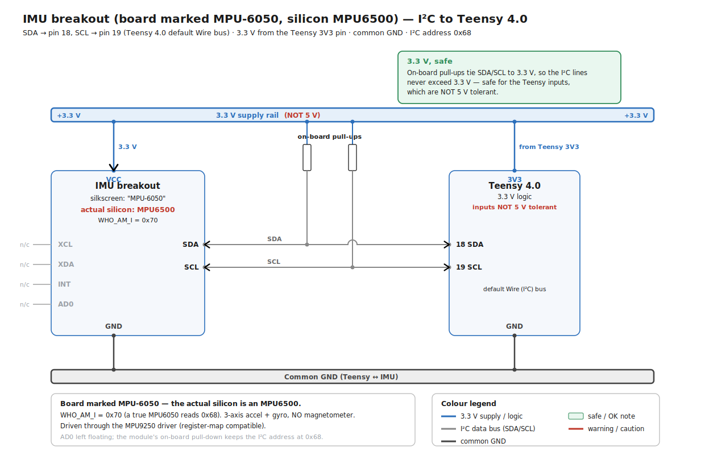

# IMU (MPU6500)

*Last updated: 2026-06-18.*

## Overview
An inertial measurement unit (accelerometer + gyroscope) on the Teensy's I²C bus. Used to improve
heading (yaw) estimation for navigation.

> ⚠️ **Important**: the board was labeled / assumed to be an **MPU6050**, but it is actually an
> **MPU6500**. This caused a lot of confusion (see below).

| | |
|---|---|
| Chip | **MPU6500** (3-axis accel + 3-axis gyro) |
| Bus | I²C, address **0x68** (AD0 = GND) |
| `WHO_AM_I` (reg 0x75) | **0x70** (an MPU6050 would return 0x68) |
| Magnetometer | none (MPU6500 has no mag; the MPU9250 would) |

## Communication (I²C → Teensy) — wiring VERIFIED 2026-06-19

The I²C wiring is shown in the diagram below.

> 📐 **[Diagram: MPU6500 IMU I²C wiring]** — *placeholder; not generated yet (prompt in the page source).*

<!-- DIAGRAM PLACEHOLDER (mpu6500-imu-i2c-wiring) — TO PLACE THE DIAGRAM, replace the blockquote line
above AND this whole comment with a single image line:
    

Generation prompt (paste to Claude):
Draw a wiring diagram for an MPU6500 IMU breakout (GY-521-style board) connected to a Teensy 4.0 over I2C.
- Supply: 3.3 V rail (NOT 5 V), GND common with the Teensy.
- SDA -> Teensy pin 18, SCL -> Teensy pin 19 (Teensy 4.0 default Wire bus).
- AD0 -> GND, which sets the I2C address to 0x68.
- Show the on-board I2C pull-up resistors pulling SDA/SCL up to 3.3 V (so the lines never exceed 3.3 V -
  safe for the non-5V-tolerant Teensy inputs); add a small green "3.3 V, safe" note.
- Label the chip: MPU6500 (3-axis accel + gyro, NO magnetometer). Note WHO_AM_I reads 0x70 and is driven
  through the MPU9250 driver.
- Grey out the unused pins: XCL, XDA (auxiliary I2C), INT (data-ready).
STYLE (keep ALL diagrams uniform): solid WHITE background - add a full-canvas white rectangle as the
first element. Flat, clean, technical look; dark text (#1a1a1a), sans-serif. Use explicit hex colours
ONLY - no CSS variables. Shared palette: 3.3 V logic = blue #2c6fbb; data buses = grey #888888;
warning/danger = red #c0392b; OK/safe = green #2e8b57. Rounded-rectangle blocks, labelled arrows,
English labels only, landscape orientation, no text overflow.
-->

- `SDA = pin 18`, `SCL = pin 19` (Teensy 4.0 default `Wire`) — confirmed on the board.
- **Supply = 3.3 V** (measured), `AD0 = GND` → address **0x68**, `GND` common with the Teensy.
- The Teensy is the I²C master; the IMU answers at 0x68.
- The firmware reads acceleration and rotation rate; it publishes raw IMU on **`/imu/data_raw`**
  (`sensor_msgs/Imu`) plus **`/imu/mag`** (`sensor_msgs/MagneticField`, see the no-magnetometer note
  below). The **filtered `/imu/data`** is produced host-side (Madgwick/EKF), not by the firmware.
  *(Older revisions of this doc said the firmware publishes `/imu/data` directly — that is outdated;
  the deployed 2026-06-29 firmware publishes `/imu/data_raw` + `/imu/mag`.)*

> ✅ **No level-shift issue here** (unlike the encoders): the GY-521 board runs on **3.3 V**, so its
> on-board I²C pull-ups pull to 3.3 V → SDA/SCL never exceed 3.3 V → safe for the Teensy 4.0.
> Unused pins: `XCL`, `XDA` (auxiliary I²C), `INT` (data-ready interrupt).

## Firmware driver — the fix
The **MPU6050** driver checks `WHO_AM_I == 0x68` and **rejects** our chip (which returns 0x70)
→ `setup()` used to hang (LED 3 blinks, no topics). The fix:

- Use **`USE_MPU9250_IMU`** in `lino_base_config.h` (instead of `USE_MPU6050_IMU`).
- The MPU9250 driver accepts it: it reads `WHO_AM_I` bits [6:1]; `0x70` → `0x38`, which its
  `testConnection()` accepts (`MPU9250.cpp`). The MPU6500 is register-compatible with the MPU9250 core
  (accel+gyro), so it works.

## Status (verified)
- ✅ `/imu/data_raw` publishes **real data**: at rest, `linear_acceleration.z ≈ 9.74 m/s²` (gravity).
- ⚠️ `/imu/mag` is published for message-shape compatibility only — the MPU6500 has **no magnetometer**,
  so it carries no real magnetic field; do not fuse it as a heading source.
- The `linear_acceleration.x ≈ -2` at rest means the IMU is **mounted at a slight tilt** (to account for
  in the URDF later).

## Fusion in the EKF (done 2026-06-18)
The IMU is now fused by the `robot_localization` **EKF** (`~/ekf.yaml`) — but **only `angular_velocity.z`**
(yaw rate). Measured behaviour at rest (robot perfectly still): gyro X/Y/Z biases are tiny, and **gyro Z
reads ~0 with a firmware deadband** → no heading drift on straight lines. During an actual turn, gyro Z
**tracks the real rotation** closely (verified against wheel odometry, e.g. both ≈ −25 °/s while turning).
Conclusion: the gyro Z is healthy and the fusion mainly **reduces heading drift in turns** (where wheels
slip). The accelerometer is **not** used (tilted mount + only yaw matters in 2D). See
the `openamr-platform-sw` navigation/architecture docs.

> ⚠️ Measure the bias only when the robot is **strictly immobile** — moving it during the capture gives a
> bogus (even sign-flipping) bias reading.

## Good to know / gotchas
- **No orientation**: the driver provides raw accel + gyro only; the orientation quaternion in
  `/imu/data_raw` is all zeros (invalid). For sensor fusion (EKF / `robot_localization`), use the
  **angular velocity** (`angular_velocity.z`, yaw rate), not the orientation.
- A tiny standalone I²C scanner project on the reference Pi (`~/i2cscan`) can re-check the bus /
  address (`WHO_AM_I`) if needed.
- The firmware default scales: accel ±2 g (`1/16384`), gyro ±250 °/s (`1/131`).
