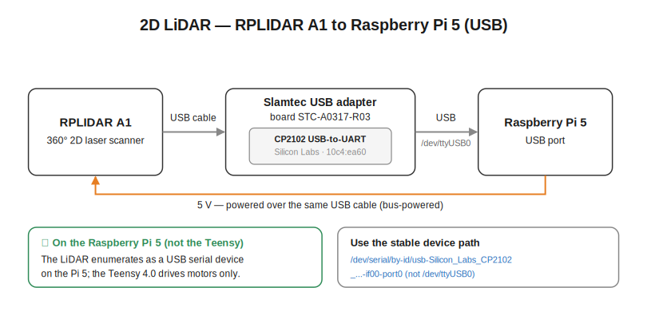

# LiDAR (RPLidar)

*Last updated: 2026-06-17.*

## Overview
A 360° 2D laser scanner used for mapping, localization and obstacle avoidance. It is connected to the
**Pi** (USB), **not** the Teensy.

| | |
|---|---|
| Family | Slamtec **RPLIDAR** (firmware 1.29, hardware rev 7, SDK 1.12) |
| USB adapter | Silicon Labs **CP2102** USB↔UART bridge (VID:PID `10c4:ea60`) |
| Output | `/scan` (`sensor_msgs/msg/LaserScan`), ~7 Hz |
| Range | 0.15 – 12 m, 360° (`angle` ≈ ±3.04 rad), increment ≈ 1.3° |

## Communication (Pi ↔ LiDAR)
The connection is shown in the diagram below.

> 📐 **[Diagram: RPLIDAR A1 connection]** — *placeholder; not generated yet (prompt in the page source).*

<!-- DIAGRAM PLACEHOLDER (lidar-connection) — TO PLACE THE DIAGRAM, replace the blockquote line
above AND this whole comment with a single image line:
    

Generation prompt (paste to Claude):
Draw a simple connection diagram for the 2D LiDAR:
- RPLIDAR A1 (360 degree 2D laser scanner) -> USB cable -> Silicon Labs CP2102 USB-to-UART bridge
  (VID:PID 10c4:ea60) -> a USB port on the Raspberry Pi 5.
- Appears as /dev/ttyUSB0 (use the stable /dev/serial/by-id/... path).
- Powered over the same USB (5 V). Note: the LiDAR is on the Pi, NOT the Teensy.
STYLE (keep ALL diagrams uniform): solid WHITE background - add a full-canvas white rectangle as the
first element. Flat, clean, technical look; dark text (#1a1a1a), sans-serif. Use explicit hex colours
ONLY - no CSS variables. Shared palette: 24 V/power = red #c0392b; 5 V = orange #e67e22; 3.3 V logic =
blue #2c6fbb; data buses = grey #888888; warning/danger = red #c0392b; OK = green #2e8b57.
Rounded-rectangle blocks, labelled arrows, English labels only, landscape orientation, no text overflow.
-->

- **Physical**: USB → `/dev/ttyUSB0`
  (stable: `/dev/serial/by-id/usb-Silicon_Labs_CP2102_USB_to_UART_Bridge_Controller_0001-if00-port0`).
- **Protocol**: Slamtec RPLIDAR serial protocol over UART, **115200 baud**, `Standard` scan mode.
- **Driver**: `rplidar_ros`, node `rplidar_composition`. Parameters used:
  ```
  serial_port: /dev/serial/by-id/usb-Silicon_Labs_CP2102_...-if00-port0
  serial_baudrate: 115200
  frame_id: lidar_link
  scan_mode: Standard
  ```
- Published frame: **`lidar_link`** (must match the URDF / static TF `base_link→lidar_link`).

## Mounting (measured)
TF `base_link→lidar_link` = **x=0.335 m, y=0, z=0.18 m, yaw=180° (π)**. The LiDAR is 33.5 cm in front of
the wheel axle, centered, and **mounted rotated 180°**: its 0° points to the **rear**; the robot's front
is the LiDAR's 180°. (Found empirically — an object placed in front shows up at ±180° in the LiDAR frame.)

## Field of view note
The robot's own frame/structure produces close returns in several directions (≈ ±20–50° and ±80–90° in
the LiDAR frame), not a clean rear block. → a **`scan_body_filter`** (provided in `openamrobot_nav2`)
must mask those self-returns to produce `/scan_filtered` for Nav2.

## Good to know / gotchas
- ⚠️ **Do not kill the driver brutally while it is scanning.** A hard SIGTERM leaves the LiDAR stuck
  (`Cannot start scan: 80008000`, then `operation time out`). To recover: **restart the node once**
  (a clean fresh start usually re-inits it); if that fails, **unplug/replug the USB**. Don't loop-respawn
  on a stuck device.
- The LiDAR also sometimes **stops publishing on its own** (node alive but `/scan` silent). A single node
  restart brings it back. Cause not yet pinned (possibly USB power / motor). To watch.
- The LiDAR motor spins up when the driver starts and stops when it stops cleanly.
- Exact model (A1/A2/…) not formally confirmed; `Standard` mode at 115200 works.
