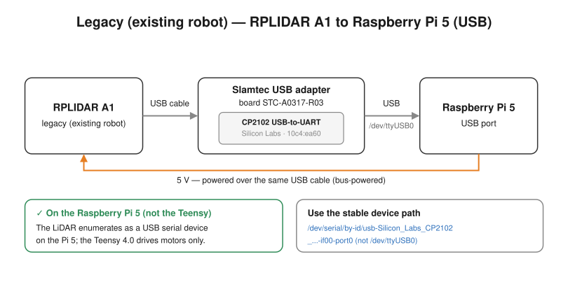
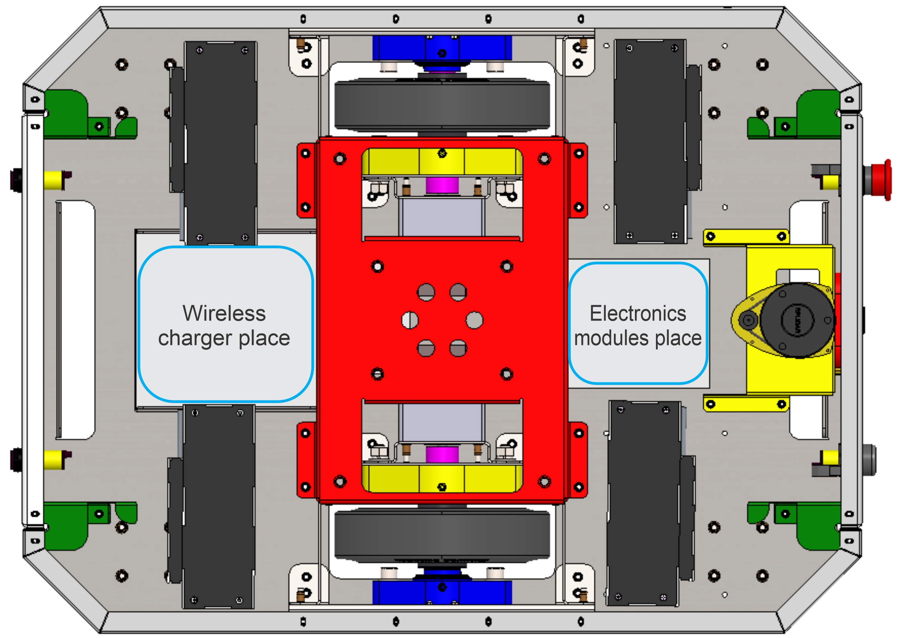

# LiDAR — RPLIDAR S3 (2.0) and RPLIDAR A1 (legacy)

*Last updated: 2026-10-03.*

## 2.0 navigation LiDAR: Slamtec RPLIDAR S3 (S3M1-R2)
The OpenAMRobot 2.0 navigation LiDAR is the **Slamtec RPLIDAR S3** (model **S3M1-R2**). It replaces the
RPLIDAR A1 of the existing robot (documented below as legacy) and supersedes the Hokuyo UST-10LX, which
was dropped. **Backup:** the RPLIDAR S2E, only if the S3 is unavailable.

**Functional sensing only — the LiDAR is not a safety device.** It feeds mapping, localization and
obstacle avoidance; it does not implement or validate any safety function.

| | |
|---|---|
| Model | Slamtec **RPLIDAR S3**, **S3M1-R2** |
| Interface | **USB to the Jetson** (2.0 reference compute) through a **USB to UART adapter** |
| Supply | **regulated 5 V rail**: **4.9 – 5.2 V**, ripple **≤ 150 mV** |
| Current | **1.2 A** at start, **0.45 A** typical running |
| Mounting | **4 × M2.5**, screw engagement **≤ 4 mm** |
| Bracket | existing A1 bracket (`MMP.07` LiDAR support) **plus a spacer plate**, so the S3 scan plane sits at the A1 scan-plane height. **Pending confirmation:** the `MMP.07` bracket identity is inferred, and the spacer plate dimensions (including thickness) are not set; both are to be confirmed from the Slamtec drawings and the physical part |
| TF | **`lidar_link` position unchanged** (same as the A1 values below); this is the **intended S3 installation target, not a measured S3 result** |
| Orientation | mounted in the **same orientation as the A1: rotated 180°**, so the static transform `base_link→lidar_link` stays unchanged: **x 0.335 m, z 0.18 m, yaw 3.14159**. This transform and the 180° orientation are the **intended S3 installation target, not a measured S3 result** |
| Scan window | **fully open — no translucent cover** in front of the scan window |

- Power comes from the regulated 5 V rail, not over the host's USB port. There is **no 12 V rail** and
  **no 24 V LiDAR branch**.
- Driver parameters (baud rate, scan mode), range and scan rate: to be set from the Slamtec
  datasheet / SDK; the A1 values below do not apply to the S3.

### Commissioning step (S3)
After mounting the S3, and **before the unchanged `base_link→lidar_link` transform is used for
navigation**, verify the `sllidar_ros2` scan orientation against the physical mounting: check where
**angle zero** points and the **direction of rotation** (for example, an object placed in front of the
robot must appear at the expected angle in the published scan). Record the result as **S3 evidence**;
until then the transform above remains the intended target only.

## Legacy (existing robot): RPLIDAR A1

### Overview
**RPLIDAR A1 — legacy (existing robot).** A 360° 2D laser scanner used for mapping, localization and
obstacle avoidance. It is connected to the **Pi** (USB), **not** the Teensy.

| | |
|---|---|
| Family | Slamtec **RPLIDAR** (firmware 1.29, hardware rev 7, SDK 1.12) |
| USB adapter | Silicon Labs **CP2102** USB↔UART bridge (VID:PID `10c4:ea60`) |
| Output | `/scan` (`sensor_msgs/msg/LaserScan`), ~7 Hz |
| Range | 0.15 – 12 m, 360° (`angle` ≈ ±3.04 rad), increment ≈ 1.3° |

### Communication (Pi ↔ LiDAR)
The connection is shown in the diagram below.



- **Physical**: USB → `/dev/ttyUSB0`
  (stable: `/dev/serial/by-id/usb-Silicon_Labs_CP2102_USB_to_UART_Bridge_Controller_0001-if00-port0`).
- **Protocol**: Slamtec RPLIDAR serial protocol over UART, **115200 baud**, `Standard` scan mode.
- **Driver**: `rplidar_ros`, node `rplidar_composition`. Parameters used:
  ```
  serial_port: /dev/serial/by-id/usb-Silicon_Labs_CP2102_...-if00-port0
  serial_baudrate: 115200
  frame_id: lidar_link
  scan_mode: Standard
  ```
- Published frame: **`lidar_link`** (must match the URDF / static TF `base_link→lidar_link`).

### Mounting (measured)
**RPLIDAR A1 evidence only (legacy, existing robot).** These measurements were taken with the A1 and are
not S3 evidence.

TF `base_link→lidar_link` = **x=0.335 m, y=0, z=0.18 m, yaw=180° (π)**. The LiDAR is 33.5 cm in front of
the wheel axle, centered, and **mounted rotated 180°**: its 0° points to the **rear**; the robot's front
is the LiDAR's 180°. (Found empirically — an object placed in front shows up at ±180° in the LiDAR frame.)

The RPLIDAR (on its bracket, right in this top view) sits ahead of the central electronics bracket:



### Field of view note
The robot's own frame/structure produces close returns in several directions (≈ ±20–50° and ±80–90° in
the LiDAR frame), not a clean rear block. → a **`scan_body_filter`** (provided in `openamrobot_nav2`)
must mask those self-returns to produce `/scan_filtered` for Nav2.

### Good to know / gotchas
- ⚠️ **Do not kill the driver brutally while it is scanning.** A hard SIGTERM leaves the LiDAR stuck
  (`Cannot start scan: 80008000`, then `operation time out`). To recover: **restart the node once**
  (a clean fresh start usually re-inits it); if that fails, **unplug/replug the USB**. Don't loop-respawn
  on a stuck device.
- The LiDAR also sometimes **stops publishing on its own** (node alive but `/scan` silent). A single node
  restart brings it back. Cause not yet pinned (possibly USB power / motor). To watch.
- The LiDAR motor spins up when the driver starts and stops when it stops cleanly.
- Exact model (A1/A2/…) not formally confirmed; `Standard` mode at 115200 works.
