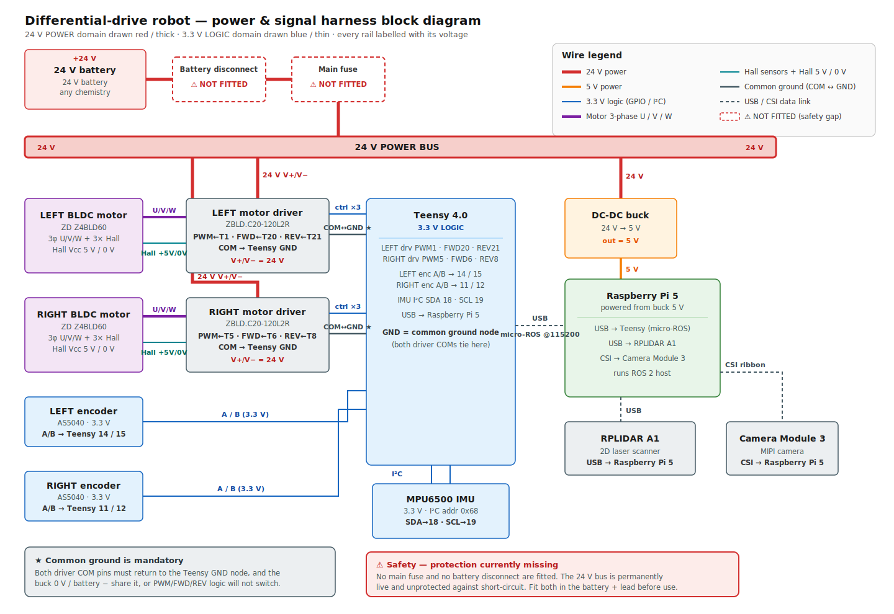

# Wiring & Teensy 4.0 pinout

*Last updated: 2026-06-19.*

Convention: **MOTOR1 = LEFT wheel, MOTOR2 = RIGHT wheel.** Logic level **3.3 V**.

> **Verification status (2026-06-19):** full wiring/component audit done. Physically verified —
> **drivers + motors** (ZBLD C20-120L2R + ZD Z4BLD60-24GN-30S, both drivers identical), **encoders**
> (AS5040; the 5 V→~4 V overvoltage was **fixed → now 3.3 V**, see [encoders.md](../sensors/encoders.md)), **IMU**
> (MPU-6500, SDA18/SCL19, 3.3 V, 0x68), **Teensy = 4.0** (i.MX RT1062), **power/24 V** (no fuse / no
> battery cut-off — see [power.md](../power_distribution/power.md)). Component list + datasheets: [components-bom.md](../../manufacturing/bom/components-bom.md).
> Still to read (completeness): LiDAR model sticker, DC-DC model, AC/DC converter, gearbox suffix.
> (Pi RAM confirmed **8 GB**, 2026-07-06 — see [raspberry-pi.md](../computing/raspberry-pi.md).)

The complete power-and-signal wiring is shown in the harness diagram below; the sections that
follow give the exact pin/terminal tables behind it.



## Teensy 4.0 pin assignment

| Function | Pin | Notes |
|---|---|---|
| **IMU** SDA | 18 | I²C data (MPU6500 @ 0x68) |
| **IMU** SCL | 19 | I²C clock |
| **Encoder LEFT (M1)** A | 14 | quadrature |
| **Encoder LEFT (M1)** B | 15 | quadrature |
| **Encoder RIGHT (M2)** A | 11 | quadrature |
| **Encoder RIGHT (M2)** B | 12 | quadrature |
| **Motor LEFT (M1)** PWM | 1 | → driver `VAR/AI2` (speed) |
| **Motor LEFT (M1)** IN_A / FWD | 20 | → driver `FWD/DI1` |
| **Motor LEFT (M1)** IN_B / REV | 21 | → driver `REV/DI2` |
| **Motor RIGHT (M2)** PWM | 5 | → driver `VAR/AI2` (speed) |
| **Motor RIGHT (M2)** IN_A / FWD | 6 | → driver `FWD/DI1` |
| **Motor RIGHT (M2)** IN_B / REV | 8 | → driver `REV/DI2` |
| Debug LED | 13 | init/status (3 blinks = init failure) |
| micro-ROS | USB | native serial, 115200 baud |

> These values are the firmware's pin configuration — see `openamr-platform-fw`.
> Note: `MOTOR1_PWM` is pin **1** (pin 21 is **not** a PWM pin on the Teensy 4.x — a common upstream pitfall).

The same assignment is shown as a physical pin map below.



## Driver wiring — ZBLD C20-120L2R (VERIFIED 2026-06-19)

Both drivers are wired **identically** (only the Teensy pins differ). The signal terminal block has 12
positions; **exactly 4 are connected** per driver (read off the board: `x`=wired, `o`=empty, from FWD):

```
FWD/DI1  REV/DI2  JOG/DI3  CLR/DI4  BRK/DI5  COM  VAR/AI2  +5V  ERR/DO1  SPD/DO2  A+  B-
   x        x        o        o        o      x      x      o      o        o     o   (o)
```

| Driver terminal | Role | ← Teensy LEFT (M1) | ← Teensy RIGHT (M2) |
|---|---|---|---|
| `VAR/AI2` | speed setpoint, analog **0–5 V** (Teensy PWM @3 kHz, filtered) | PWM **1** | PWM **5** |
| `FWD/DI1` | forward direction (digital) | IN_A **20** | IN_A **6** |
| `REV/DI2` | reverse direction (digital) | IN_B **21** | IN_B **8** |
| `COM` | **common ground — mandatory** | GND | GND |

The driver's connected terminals and their Teensy links are shown below.


Unused: `JOG/DI3`, `CLR/DI4`, `BRK/DI5` (brake), `+5V`, `ERR/DO1` (no fault read-back), `SPD/DO2`
(no speed feedback to the Teensy), `A+/B−` (RS485 not used). Speed/gain is set by the on-board **VAR/AI1**
pot + **ACC/DEC** ramp pot (see [motors-drivers.md](../motor_control/motors-drivers.md)).

> ⚠️ The Teensy uses the `USE_GENERIC_2_IN_MOTOR_DRIVER` profile (PWM + INA + INB). On this BLDC driver
> that maps cleanly: PWM→speed (`VAR/AI2`), INA→`FWD/DI1`, INB→`REV/DI2`. The driver does its own
> commutation from the Hall sensors — the Teensy never sees U/V/W.

### DIP switches (config applied 2026-06-19, identical both drivers)
| SW1 | SW2 | SW3 | SW4 | SW5 | SW6 |
|---|---|---|---|---|---|
| **OFF** | **ON** | OFF | **ON** | **ON** | OFF |

The switch positions are shown below.



- **SW1 = OFF → open loop** (driver is a power stage; the **Teensy PID** is the sole regulator — best
  for this robot, removes the double loop). *Was ON (closed loop); changed 2026-06-19.* Validated: smooth.
- **SW2 = ON → speed source = AI2** (the external 0–5 V input where our PWM arrives). Must stay ON.
- **SW4 = ON, SW5 = ON → 5 pole pairs** (motor is P=5). *Was OFF/OFF (=2 pp, wrong); corrected.*
  Irrelevant in open loop but set correctly for future closed-loop use.
- **SW6 = OFF** (no RS485). See the full rationale in [motors-drivers.md](../motor_control/motors-drivers.md).
- ⚠️ With SW2=ON (AI2 source), the **VAR pot is inert** for balancing — speed comes from the PWM, not the
  pot. The residual ~9 % open-loop L/R asymmetry is handled by the Teensy PID (→ ~0.2 %).

## Motor wiring (per motor) — VERIFIED 2026-06-19
Driver **power**: `V+ / V− = 24 V DC` (大 screw terminals, bottom-right, `电源DC24V`), fused.

> ⚠️ **DC power wire colours on THIS robot** (confirmed 2026-06-18, counter-intuitive — AC-style colours on
> a DC bus): **brown = + (V+, i.e. the DC "red")**, **blue = − (V−, i.e. the DC "black")**. Colour is only a
> presumption — **verify with a multimeter** before connecting a 24 V lead. See [power.md](../power_distribution/power.md).

Driver **motor connector** (white Molex, 8 pins):

| `U` | `V` | `W` | `Hu` | `Hv` | `Hw` | `Vcc` | `0V` |
|---|---|---|---|---|---|---|---|
| phase U | phase V | phase W | Hall U | Hall V | Hall W | +5 V (Hall supply) | GND (Hall) |

> 🔧 **Left-wheel blocker:** the left signal wiring (4 terminals above) is **proven healthy**, so the
> intermittent left wheel is NOT here — it's on the **24 V power (V+/V−)** or the **motor connector**
> (a phase or the Molex). That's where to chase the faux-contact (continuity test while flexing). See
> the `openamr-platform-sw` troubleshooting doc (`docs/troubleshooting/diagnostics.md` in that repo) and the `amr-left-wheel-faux-contact` memo.

## Grounding
All grounds must be common: **Teensy GND ↔ driver COM**. A floating COM was a real source of noise
concern (see the `openamr-platform-sw` troubleshooting doc (`docs/troubleshooting/diagnostics.md` in that repo)).

## ASCII map
```
                 Teensy 4.0 (3.3V)
   IMU  ── SDA18/SCL19 ───────────────► MPU6500 (I2C 0x68)
   ENC L ── A14/B15 ──────────────────► encoder LEFT
   ENC R ── A11/B12 ──────────────────► encoder RIGHT
   M1   ── PWM1 / IN20 / IN21 ────────► driver LEFT  ── U/V/W ─► motor LEFT
   M2   ── PWM5 / IN6 / IN8 ──────────► driver RIGHT ── U/V/W ─► motor RIGHT
   USB ───────────────────────────────► Raspberry Pi (micro-ROS 115200)
   GND ───────────────────────────────► COM of both drivers (common)

```


Schematic to understand how Emergency switch and reset button works.

## Schneider (genuine, ~€20–35):
Harmony XB4-BS542 — Ø22 mm mount, red Ø40 mm mushroom, twist-to-release, metal bezel, 1NC (add a ZBE-102 block for a second NC channel). Certified positive-opening contacts per IEC 60947-5-5 — the one to use for anything CE-facing.
→ https://www.se.com/ww/en/product/XB4BS542/
Plastic-bezel equivalent: XB5-AS542, same page structure at se.com.

## Chinese clone (~€1–5):
XB2-BS542 — same Ø22/Ø40 form factor, 1NC, twist release, 10 A Ith, IP65, IEC 60947-5-1, but no e-stop-specific certification. Fine for prototypes and internal testing.
→ https://www.amazon.com/XB2-BS542-Emergency-Button-Switch-pushbutton/dp/B07Y7KZDSH
→ direct from manufacturer, ~$1/pc: https://www.finglai.com/products/switches/push-buttons/DIA22-XB2-B/XB2-BS542.html
LAY37 is the same class, usually sold as NO+NC: https://www.amazon.com/LAY37-Mushroom-Emergency-Button-Switch/dp/B07DL333VL [eBay](https://www.ebay.com/itm/356714450971)[Electric-b2c](https://www.electric-b2c.com/products/button-switch-self-reset-xb2-small-mushroom-head-emergency-stop-22mm-knob-key-start-inching-power-on-xb2-bs542-xb2-ba31-xb2-ba42)
Reminder: contacts are ~3 A DC-13 at 24 V, so for the OpenAMRobot battery bus, break a contactor coil with the NC contacts rather than the full motor current.
