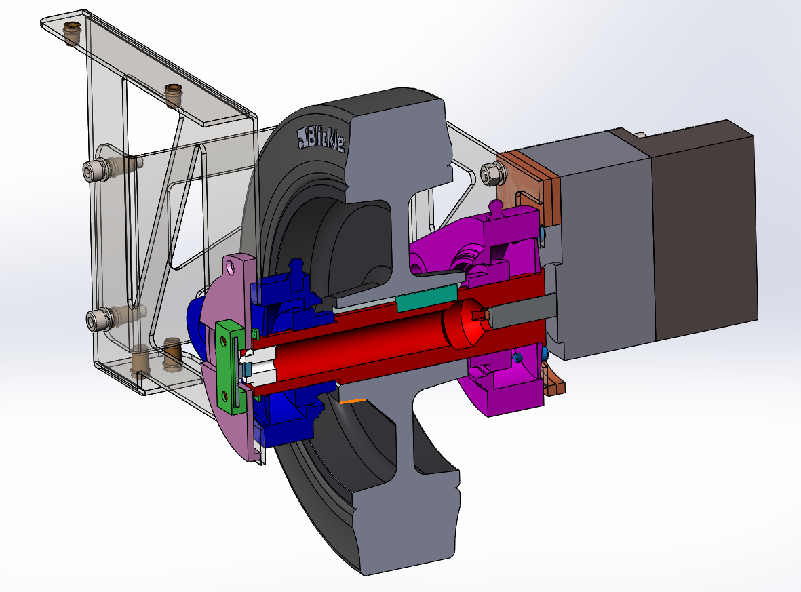
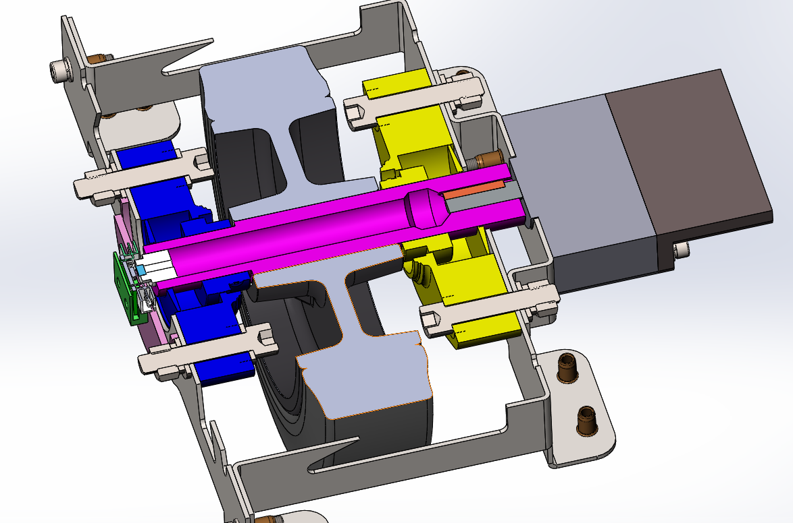
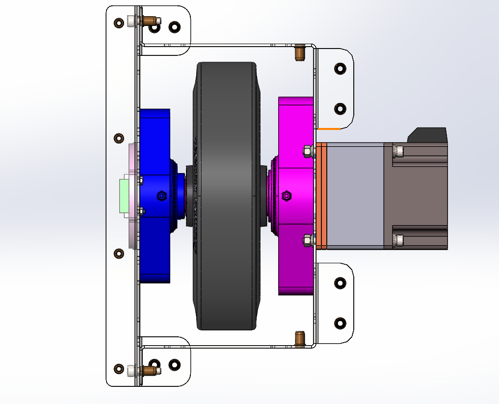
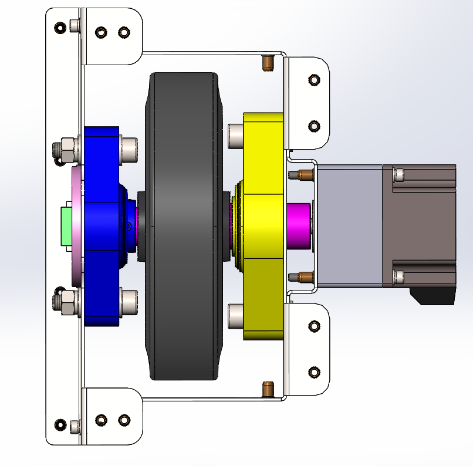
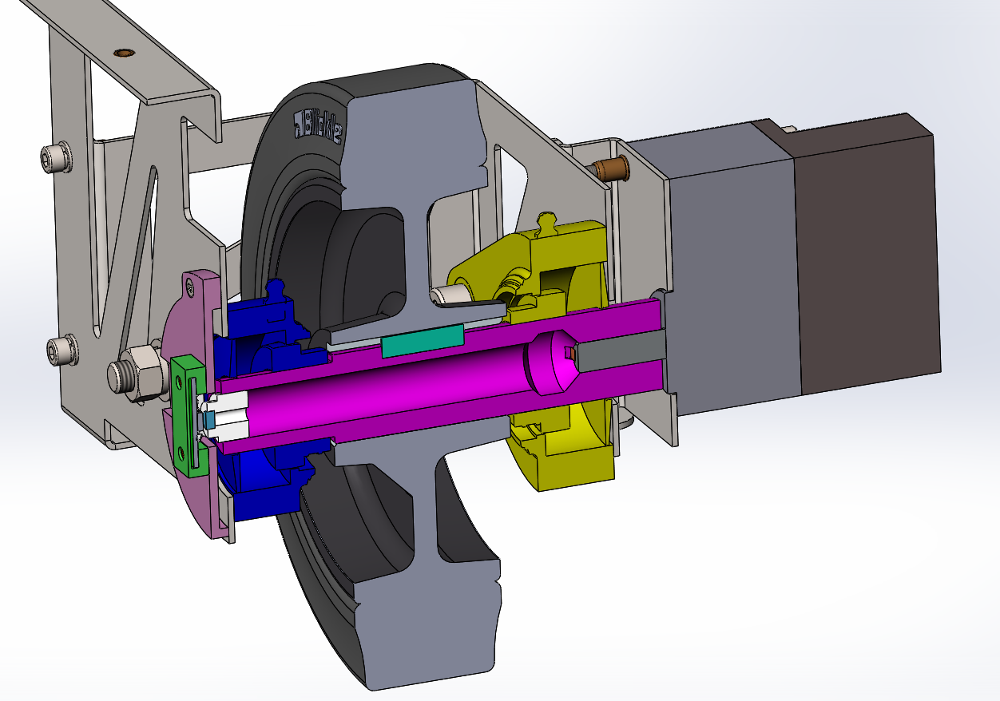

# Assembly

## 🔩 Wheel Assembly Tutorial

▶️ Step-by-step assembly of the OpenAMRobot drive wheel module.

The drive-wheel assembly (motor + gearbox + drive shaft + brackets, `MMP.03.*` in
[../../mechanical/](../../mechanical/)) is assembled in the sequence shown below. Follow the same
order left and right.

**Step 1**

**Step 2**

**Step 3**

**Step 4**

**Step 5**

See the per-part production drawings (PDF/DXF) in
[../../mechanical/cad/production_files/](../../mechanical/cad/production_files/).
