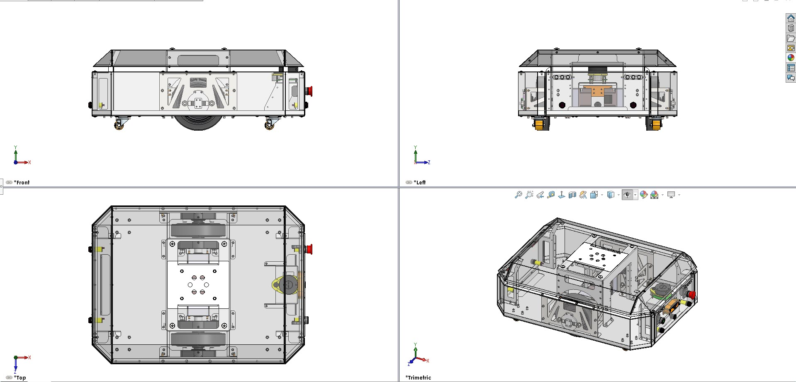
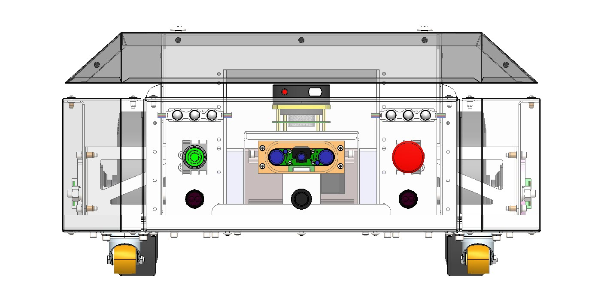

# Mechanical

Chassis and mechanical design of the OpenAMRobot base — the **MMP (Multipurpose Mobile Platform)**.
The CAD, production drawings, and renders come from the OpenAMRobot design repository.

> Binary CAD files (`.STEP .SLDPRT .SLDASM .SLDDRW .DXF .PDF .zip`) are stored with **Git LFS**
> (see the repo `.gitattributes`). Clone with Git LFS installed to pull the actual files.

## Contents

- **[`cad/`](cad/)** — 3D models and production files (see [`cad/README.md`](cad/README.md)):
  - `cad/Full_assembly_STEP/` — the complete robot as a single STEP assembly.
  - `cad/production_files/` — per-part production set: **PDF + DXF** (order parts without CAD) plus
    **SLDPRT / SLDDRW / STEP** (native + neutral).
  - `cad/SW17_full_project/` — the full SolidWorks 2017+ project (`.zip`).
- **[`renderings/`](renderings/)** — CAD renders and robot views (see the note on base vs. product vision below).
- `chassis/`, `drawings/` — reserved (production drawings currently live alongside the models in
  `cad/production_files/`).

## Part numbering (MMP)

Files follow `MMP.<assembly>...<part>` (and `PT1.*` for shared parts):

| Group | Assembly |
|---|---|
| `MMP.00` | Platform-level: full assembly, front / back / side panels, plastic cover |
| `MMP.01` | Cover assembly (cover, flange) |
| `MMP.02` | Base assembly |
| `MMP.03` | **Wheel assembly** (wheel brackets, motor bracket, drive shaft) |
| `MMP.04` | Center bracket assembly |
| `MMP.05` | Support assembly |
| `MMP.07` | LiDAR support assembly |
| `PT1.00.00.*` | Shared parts: camera upper body, magnetic encoder, adapter, bracket, cover |

## Renders: base vs. product vision

`renderings/` mixes two things — read the file names:

- **Base platform** (what this repo documents): `AMR_*` views (front / side / bottom / top,
  transparent, uncovered) and `MMP_0x.jpg`.
- **Full product vision** (roadmap, *not* the base build): `OpenAMR_*` and `Open_AMR_*` renders show
  the platform with **optional attachments** (e.g. the dual-arm manipulator). These illustrate where
  the platform is heading — see [../product-architecture.md](../product-architecture.md).

### Base platform — key views

| Transparent (cover shown) | Cut-away (internals) |
|---|---|
|  |  |

| Orthographic views (front / left / top / trimetric) | Front panel |
|---|---|
|  |  |

Side / bottom and the SolidWorks assembly renders `MMP_01`–`MMP_05` are also in
[`renderings/`](renderings/).

## Drivetrain (as-built)

Wheel **⌀ 0.2 m**, track **0.46 m** (firmware-measured — see
[../manufacturing/bom/components-bom.md](../manufacturing/bom/components-bom.md)). Heavy-duty drive
wheel and swivel castor are the Blickle parts listed in
[../manufacturing/bom/mechanical-bom.md](../manufacturing/bom/mechanical-bom.md).
