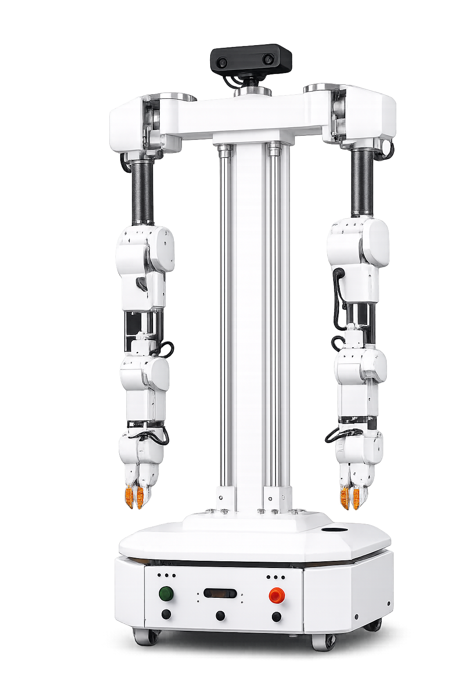

# Product architecture — base platform vs. options

This repository documents the **base OpenAMRobot differential-drive platform** — the robot that has
actually been wired, flashed, and driven. The base is one configuration of a larger product vision
(the "industrial product version"): the same chassis and compute, extended with optional attachments
and sensor packs.

This page separates the two so nothing here implies the base build ships with a lift, a conveyor, or
a wireless charger — it does not.

## The full product architecture (superset)

## What the base build actually is

The **✅ base** (this repo's electrical / firmware / software) is the core of that diagram:

- **Drive:** 2× BLDC wheels, **ZBLD.C20-120L2R** drivers, **AS5040** magnetic encoders, Teensy 4.0
  running micro-ROS motor control (electronics derived from the Linorobot project, motor + controller
  upgraded to the ZD/ZBLD industrial parts).
- **Compute:** Raspberry Pi 5 + ROS 2 Jazzy + Nav2.
- **Sensing:** RPLIDAR A1 (2D), Pi Camera Module 3, MPU6500 IMU.
- **Power:** 24 V bus (any chemistry; reference build 2× 12 V; the product targets a LiFePO4 + BMS pack).

## What is optional / roadmap (⚙️ NOT on the base build)

The same base platform, extended toward the full product vision (here with the dual-arm manipulator
attachment — **illustrative, not the base build**):

Shown in the architecture diagram but **not part of the base**:

- **Extra safety pack** — ultrasonic (JSN-SR04) + IR (E18-D80NK) proximity rings.
- **Attachments** — tilt sorting, conveyor, **lift** (BLDC lift/rotate), end-effectors.
- **Charging** — **wireless charging** (WCM-300) with auto-docking.
- **Battery/BMS** — 24 V smart battery pack + BMS (serial), vs. the base's plain 24 V pack.
- **Higher-power drives** — ZLTech ZLAC8015D/8030L drivers, hub-motor wheels.
- **Tracking / AI** — QR + line tracking, on-board NVIDIA (Jetson) for heavier perception.
- **Fleet** — cloud server, fleet management, dashboards (RMF).

Datasheets for the optional parts are under [`datasheets/`](datasheets/) and clearly marked as options.
